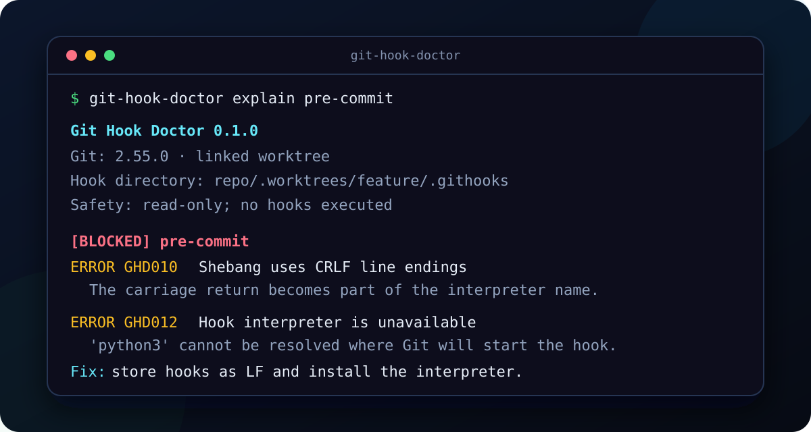

<p align="center">
  
</p>

<h1 align="center">Git Hook Doctor</h1>

<p align="center"><strong>Explain why a Git hook will—or won't—run.</strong></p>

<p align="center">
  <a href="https://github.com/cuijialin8888-code/git-hook-doctor/actions/workflows/ci.yml"></a>
  <a href="https://github.com/cuijialin8888-code/git-hook-doctor/releases"></a>
  
  <a href="LICENSE"></a>
</p>

<p align="center">
  Read-only · offline · zero runtime dependencies · Windows, macOS, and Linux
</p>



Git hooks fail silently for surprisingly different reasons: the file is in the wrong hook directory, a linked worktree changed how a relative `core.hooksPath` resolves, a checkout added CRLF to the shebang, the executable bit disappeared, or a configured hook uses a feature this Git version does not understand.

Git Hook Doctor asks Git for the **effective** paths and config provenance, inspects the resolved hook files, and gives file-level evidence. It never runs a hook and never changes the repository.

## Install

Install the versioned wheel with [pipx](https://pipx.pypa.io/) (recommended):

```console
pipx install https://github.com/cuijialin8888-code/git-hook-doctor/releases/download/v0.1.0/git_hook_doctor-0.1.0-py3-none-any.whl
```

Or install directly from the versioned release tag:

```console
python -m pip install "git+https://github.com/cuijialin8888-code/git-hook-doctor.git@v0.1.0"
```

Requirements: Python 3.10+ and Git 2.31+.

## Thirty-second diagnosis

```console
git-hook-doctor explain pre-commit
git-hook-doctor check
git-hook-doctor check pre-commit commit-msg pre-push
```

Machine-readable reports are built in:

```console
git-hook-doctor check --format json --output hook-report.json
git-hook-doctor check --format sarif --output hook-report.sarif
git-hook-doctor check --format markdown --output hook-report.md
git-hook-doctor check --format github
```

`github` emits native workflow-command annotations for a CI log. It is useful
when a full SARIF upload is not needed; both formats remain read-only and hook
bodies are never copied into the annotation.

Run it against any repository without changing directories:

```console
git-hook-doctor explain pre-push --repo ../my-project
```

Select the exact Git binary used by an IDE or another tool when several versions are installed:

```console
git-hook-doctor explain pre-commit --git "/opt/homebrew/bin/git"
```

## What it diagnoses

| Area | Evidence checked |
|---|---|
| Effective hook path | `git rev-parse --git-path hooks`, bare repositories, linked worktrees, event-specific client/receive working directories, relative and absolute `core.hooksPath` |
| Traditional hooks | exact filename, Git for Windows `.exe` fallback, `.sample`/extension mistakes, regular file or symlink, executable bit on POSIX, empty files |
| Script startup | shebang at byte zero, UTF-8 BOM, CRLF on the first line, interpreter resolution, Git for Windows' bundled shell |
| Configured hooks | `hook.<name>.event`, `command`, `enabled`, event switches, config scope and origin |
| Git compatibility | configured hooks on Git before 2.54; event switches and parallel settings before 2.55 |
| Shadowed installs | hook-like files in the default directory, `.husky`, `.githooks`, or `.git-hooks` while Git resolves elsewhere |

Every finding has a stable `GHD###` rule ID, severity, evidence, and a bounded fix. See the [rule reference](docs/rules.md).

## Why another hook tool?

Git Hook Doctor has a deliberately narrow job: **resolution diagnostics**.

| Tool | Best question |
|---|---|
| `git hook list` (Git 2.54+) | Which configured and traditional hooks are registered for this event? |
| Husky, Lefthook, pre-commit | How do I install and manage hooks in this framework? |
| Hook linters/security scanners | Does the hook body contain risky or non-portable commands? |
| **Git Hook Doctor** | Why will this hook not start in this repository, worktree, OS, and Git version? |

It does not replace a hook manager, audit arbitrary shell behavior, score repository health, or auto-repair files.

## Git 2.54 and the second hook model

[Git 2.54 introduced configured hooks](https://github.com/git/git/blob/master/Documentation/RelNotes/2.54.0.adoc): multiple named commands can be attached to the same event through `hook.<friendly-name>.event` and `hook.<friendly-name>.command`. Traditional files in the effective hook directory still run last. Git 2.55 adds event-level switches and parallel execution controls.

Git Hook Doctor understands both models and points out when a configuration is newer than the Git binary that is supposed to honor it. The [configured-hook guide](docs/configured-hooks.md) shows the exact behavior.

## Exit codes

| Code | Meaning |
|---:|---|
| `0` | Inspection completed and did not meet the `--fail-on` threshold |
| `1` | Invalid input, non-repository path, Git failure, or report write failure |
| `2` | Inspection completed and found the selected severity threshold |

The default is `--fail-on error`. Use `--fail-on warning` for a stricter CI gate or `--fail-on never` for inventory-only runs.

## GitHub Actions

```yaml
permissions:
  contents: read

steps:
  - uses: actions/checkout@3d3c42e5aac5ba805825da76410c181273ba90b1 # v7.0.1
  - uses: actions/setup-python@5fda3b95a4ea91299a34e894583c3862153e4b97 # v7.0.0
    with:
      python-version: "3.12"
  - uses: cuijialin8888-code/git-hook-doctor@2c969511e3998153a94a84609e1085299d9a8ef0 # v0.1.0
    with:
      fail-on: error
```

The full commit SHAs make the copyable workflow resistant to a moved tag; the comments retain the human-readable versions.

For SARIF upload and a complete workflow, see [examples/github-actions.yml](examples/github-actions.yml).

## Safety boundary

Git Hook Doctor runs read-only Git queries and reads a bounded set of config and hook files. It does **not**:

- invoke `git hook run` or any hook event;
- execute or source a hook body;
- edit Git config, permissions, line endings, or files;
- call a network service or send telemetry;
- claim that a hook is safe merely because it can start.

Reports show only a statically unambiguous command target. Configured-hook arguments, environment assignments, and shell bodies are omitted so a normal diagnostic report does not copy embedded tokens into JSON or SARIF.

Static inspection cannot reproduce a GUI client's private environment, a future PATH change, a `noexec` network mount, or the hook's runtime behavior. Those limits are reported in [docs/limitations.md](docs/limitations.md).

## Documentation

- [How resolution works](docs/how-it-works.md)
- [Rule reference](docs/rules.md)
- [Configured hooks in Git 2.54+](docs/configured-hooks.md)
- [Known limits and non-goals](docs/limitations.md)
- [JSON report schema](schemas/report.schema.json)
- [Diagnostic workflow](docs/diagnostic-workflow.md)
- [Chinese README / 中文说明](README.zh-CN.md)

## Contributing

Small, evidence-backed rules are welcome. A new rule needs a reproducible fixture, a stable rule ID, a false-positive analysis, and tests on every affected OS. Start with [CONTRIBUTING.md](CONTRIBUTING.md).

## License

MIT © 2026 Jialin Cui
